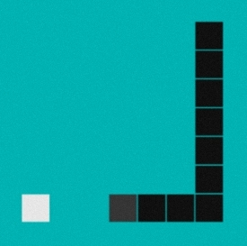

  

 

<h1 align="center">Simple Snake Game</h1>

A repository to hold the Java code for a simple snake game.

 

## **Using This Code**

- Ensure Java is installed 
- Compile the code: javac Snake.java
- Run the code: java SnakeGame